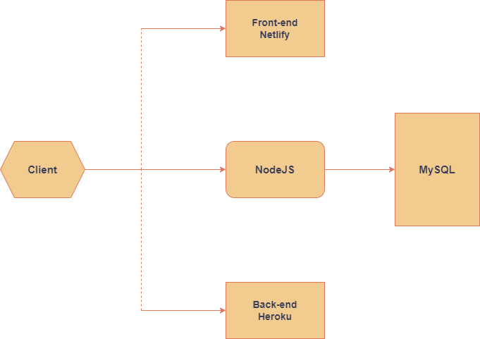

# Discord Clone App

Functional Discord Clone App with messages, channels, servers and friends featuers. All features are shown below.

## Requirements

- App will not work properly if PORT will not be set to 3000. If you run app with Docker then PORT will be default set to 3000.

- If you want run app locally with Docker you will have to install Docker Desktop and then you can install and run app with steps below.

## Installation and run with Docker

To run the app with Docker, follow these steps:

1. Download and install [Docker Desktop](https://www.docker.com/products/docker-desktop)

2. Clone the repository by running the following command in your terminal:

```javascript
    git clone git@github.com:kvbaurb99/Discord-Clone.git
```

3. Navigate to the `Discord-Clone` directory in your terminal and run the following command to start the app in development mode:

``` javascript
    docker-compose -f docker-compose-dev.yml up
```

This will start the app and print logs to the console. You can view the app by opening a web browser and navigating to http://localhost:3000.

Note that you should run this command in the directory where the docker-compose.dev.yml file is located.

## List of functions

### Authentication 

- Login: Allow users to log in with their email and password. Passwords are hashed and stored securely.
- Signup: Allow new users to create an account with a minimum password length of 6 characters. Passwords are hashed and stored securely.
- Logout: Allow users to log out of their account.

### Servers

- Create server: Allow users to create a new server with a name and color.
- Delete server: Allow users to delete a server, including all channels and messages associated with it.

### Channels
- Create channel: Allow users to create a channel within a server.
- Delete channel: Allow users to delete a channel within a server.

### Messaging 

- Send message: Allow users to send messages on a channel.
- Delete message: Allow users to delete their own messages.
- Send friend request: Allow users to send a friend request to another user.
- Accept/reject friend request: Allow users to accept or reject friend requests from other users.
- Send private message: Allow users to send private messages to their friends.
- Delete friend: Allow users to delete friends from their friends list.

### User profile 

- Change username: Allow users to change their username.

### Other

- Input validation: Validate user input to prevent empty fields or channels that already exist.
- Notifications: Notify users when they receive friend requests or private messages.

## Technologies

- HTML
- CSS with Tailwind CSS
- Javascript
- React
- NodeJS with Express
- MySQL Database
- Docker

## App Architecture Diagram
<br>



